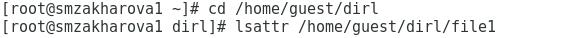
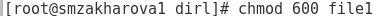
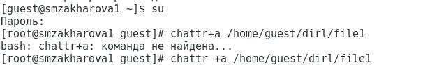
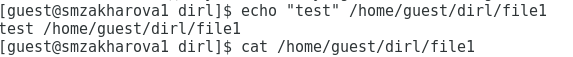
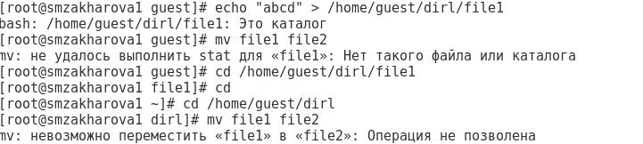
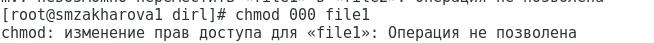
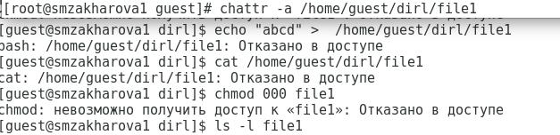
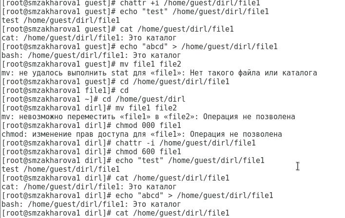

---
## Front matter
lang: ru-RU
title: Лабораторная работа №4. Дискреционное разграничение прав в Linux. Расширенные атрибуты.
author: Захарова Софья Михайловна

## Formatting
toc: false
slide_level: 2
##theme: metropolis
mainfont: PT Serif 
romanfont: PT Serif
sansfont: PT Sans
monofont: PT Mono
header-includes: 
## - '\metroset{progressbar=frametitle,sectionpage=progressbar,numbering=fraction}'
 - '\makeatletter'
## - '\beamer@ignorenonframefalse'
 - '\makeatother'
aspectratio: 43
section-titles: true
---
# Цель работы

Получение практических навыков работы в консоли с расширенными атрибутами файлов.

---
# Задание

Лабораторная работа подразумевает работу с виртуальной машиной VirtualBox, операционной системой Linux, дистрибутивом Centos и закрепление теоретических основ получения практических навыков работы в консоли с атрибутами файлов.

---
# Выполнение лабораторной работы

1. От имени пользователя guest определил расширенные атрибуты файла /home/guest/dir1/file1 с помощью команды lsattr /home/guest/dir1/file1: (рис.1).

{ #fig:001 width=50% }

---

2. Установила командой chmod 600 file1 на файл file1 права, разрешающие чтение и запись для владельца файла (рис.2).

{ #fig:002 width=50% }

---

3. Попробовала установить на файл /home/guest/dir1/file1 расширенный атрибут a от имени пользователя guest с помощью команды chattr +a /home/guest/dir1/file1. Получила отказ от выполнения операции (рис.3). 

{ #fig:003 width=50% }

---

4. С помощью команды su повысила свои права. Установила расширенный атрибут а на файл /home/guest/dir1/file1 от имени суперпользователя с помощью команды: chattr +a /home/guest/dir1/file1 (рис.4): 

{ #fig:004 width=50% }

---

5. От пользователя guest проверила правильность установления атрибута с помощью команды lsattr /home/guest/dir1/file1: (рис.5):

{ #fig:005 width=50% }

---

6. Выполнила дозапись в файл file1 слова “test” с помощью команды echo “test” /home/guest/dir1/file1. После этого с помощью команды cat /home/guest/dir1/file1 убедилась, что слово было успешно записано в файл (рис. 6).

{ #fig:006 width=50% }

---

7. Попробовала стереть имеющуюся информацию в файле с помощью команды echo «abcd» > /home/guest/dir1/file1. Попробовала переиместить файл, но получила отказ (рис.7).

{ #fig:007 width=50% }

---

8. Попробовала с помощью команды chmod 000 file1 установить на файл file1 права, например, запрещающие чтение и запись для владельца файла. Не удалось выполнить (рис. 8).

{ #fig:008 width=50% }

---

9. Сняла расширенный атрибут а с файла /home/guest/dir1/file1 от имени суперпользователя с помощью команды chattr -a /home/guest/dir1/file1. Повторила операции, которые ранее не удалось выполнить (рис. 9).

{ #fig:009 width=50% }

---

10. Повторила все действия по шагам, заменив атрибут «а» атрибутом «i». (рис. 10).

{ #fig:010 width=50% }

---
# Выводы

Во время выполнения данной лабораторной работы, я повысила свои навыки использования интерфейса командной строки (CLI), познакомилась на примерах с тем, как используются основные и расширенные атрибуты при разграничении доступа. Я имела возможность связать теорию дискреционного разделения доступа с ее реализацией на практике в OC Linux. Так же опробовала действие на практике расширенных атрибутов «а» и «i».

---

## {.standout}

Спасибо за внимание!
