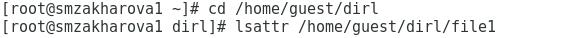
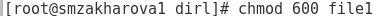
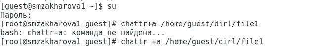
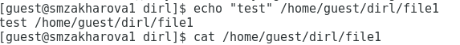
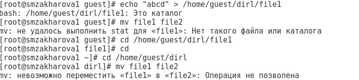
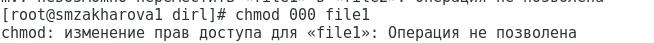
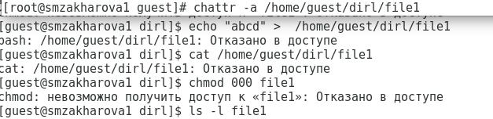
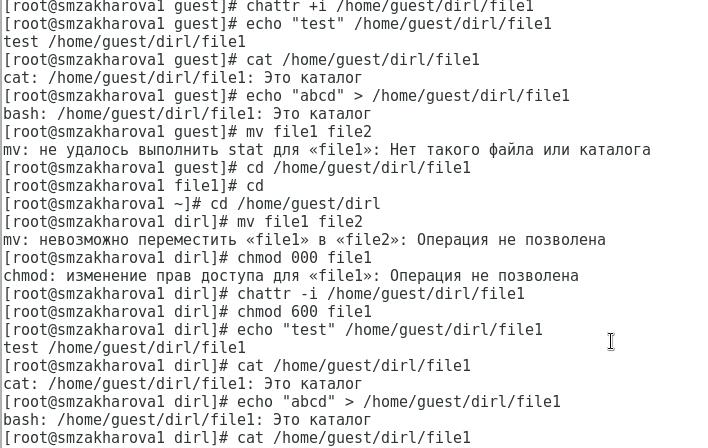

---
# Front matter
title: "Отчёт по лабораторной работе №4"
subtitle: "Дискреционное разграничение прав в Linux. Расширенные атрибуты."
author: "Захарова Софья Михайловна"

# Generic otions
lang: ru-RU

# Bibliography
bibliography: bib/cite.bib
csl: pandoc/csl/gost-r-7-0-5-2008-numeric.csl

# Pdf output format
toc: true # Table of contents
toc_depth: 2
lof: true # List of figures
lot: true # List of tables
fontsize: 12pt
linestretch: 1.5
papersize: a4
documentclass: scrreprt
## I18n
polyglossia-lang:
  name: russian
  options:
	- spelling=modern
	- babelshorthands=true
polyglossia-otherlangs:
  name: english
### Fonts
mainfont: PT Serif
romanfont: PT Serif
sansfont: PT Sans
monofont: PT Mono
mainfontoptions: Ligatures=TeX
romanfontoptions: Ligatures=TeX
sansfontoptions: Ligatures=TeX,Scale=MatchLowercase
monofontoptions: Scale=MatchLowercase,Scale=0.9
## Biblatex
biblatex: true
biblio-style: "gost-numeric"
biblatexoptions:
  - parentracker=true
  - backend=biber
  - hyperref=auto
  - language=auto
  - autolang=other*
  - citestyle=gost-numeric
## Misc options
indent: true
header-includes:
  - \linepenalty=10 # the penalty added to the badness of each line within a paragraph (no associated penalty node) Increasing the value makes tex try to have fewer lines in the paragraph.
  - \interlinepenalty=0 # value of the penalty (node) added after each line of a paragraph.
  - \hyphenpenalty=50 # the penalty for line breaking at an automatically inserted hyphen
  - \exhyphenpenalty=50 # the penalty for line breaking at an explicit hyphen
  - \binoppenalty=700 # the penalty for breaking a line at a binary operator
  - \relpenalty=500 # the penalty for breaking a line at a relation
  - \clubpenalty=150 # extra penalty for breaking after first line of a paragraph
  - \widowpenalty=150 # extra penalty for breaking before last line of a paragraph
  - \displaywidowpenalty=50 # extra penalty for breaking before last line before a display math
  - \brokenpenalty=100 # extra penalty for page breaking after a hyphenated line
  - \predisplaypenalty=10000 # penalty for breaking before a display
  - \postdisplaypenalty=0 # penalty for breaking after a display
  - \floatingpenalty = 20000 # penalty for splitting an insertion (can only be split footnote in standard LaTeX)
  - \raggedbottom # or \flushbottom
  - \usepackage{float} # keep figures where there are in the text
  - \floatplacement{figure}{H} # keep figures where there are in the text
---

# Цель работы

Получение практических навыков работы в консоли с расширенными атрибутами файлов.

# Задание

Лабораторная работа подразумевает работу с виртуальной машиной VirtualBox, операционной системой Linux, дистрибутивом Centos и закрепление теоретических основ получения практических навыков работы в консоли с атрибутами файлов.

# Выполнение лабораторной работы

От имени пользователя guest определила расширенные атрибуты файла /home/guest/dir1/file1 с помощью команды lsattr /home/guest/dir1/file1: (рис.1).

{ #fig:001 width=70% }

Установила командой chmod 600 file1 на файл file1 права, разрешающие чтение и запись для владельца файла (рис.2).

{ #fig:001 width=70% }

Попробовала установить на файл /home/guest/dir1/file1 расширенный атрибут a от имени пользователя guest с помощью команды chattr +a /home/guest/dir1/file1. Получила отказ от выполнения операции (рис.3). 

{ #fig:001 width=70% }

С помощью команды su повысила свои права. Установила расширенный атрибут а на файл /home/guest/dir1/file1 от имени суперпользователя с помощью команды: chattr +a /home/guest/dir1/file1 (рис.4): 

{ #fig:001 width=70% }

От пользователя guest проверила правильность установления атрибута с помощью команды lsattr /home/guest/dir1/file1: (рис.5):

{ #fig:001 width=70% }

Выполнила дозапись в файл file1 слова “test” с помощью команды echo “test” /home/guest/dir1/file1. После этого с помощью команды cat /home/guest/dir1/file1 убедилась, что слово было успешно записано в файл (рис. 6).

{ #fig:001 width=70% }

Попробовала стереть имеющуюся информацию в файле с помощью команды echo «abcd» > /home/guest/dir1/file1. Попробовала переиместить файл, но получила отказ (рис.7).

{ #fig:001 width=70% }

Попробовала с помощью команды chmod 000 file1 установить на файл file1 права, например, запрещающие чтение и запись для владельца файла. Не удалось выполнить (рис. 8).

{ #fig:001 width=70% }

Сняла расширенный атрибут а с файла /home/guest/dir1/file1 от имени суперпользователя с помощью команды chattr -a /home/guest/dir1/file1. Повторила операции, которые ранее не удалось выполнить (рис. 9).

{ #fig:001 width=70% }

Повторила все действия по шагам, заменив атрибут «а» атрибутом «i». (рис. 10).

{ #fig:001 width=70% }

# Выводы

Во время выполнения данной лабораторной работы, я повысила свои навыки использования интерфейса командной строки (CLI), познакомилась на примерах с тем, как используются основные и расширенные атрибуты при разграничении доступа. Я имела возможность связать теорию дискреционного разделения доступа с ее реализацией на практике в OC Linux. Так же опробовала действие на практике расширенных атрибутов «а» и «i».
